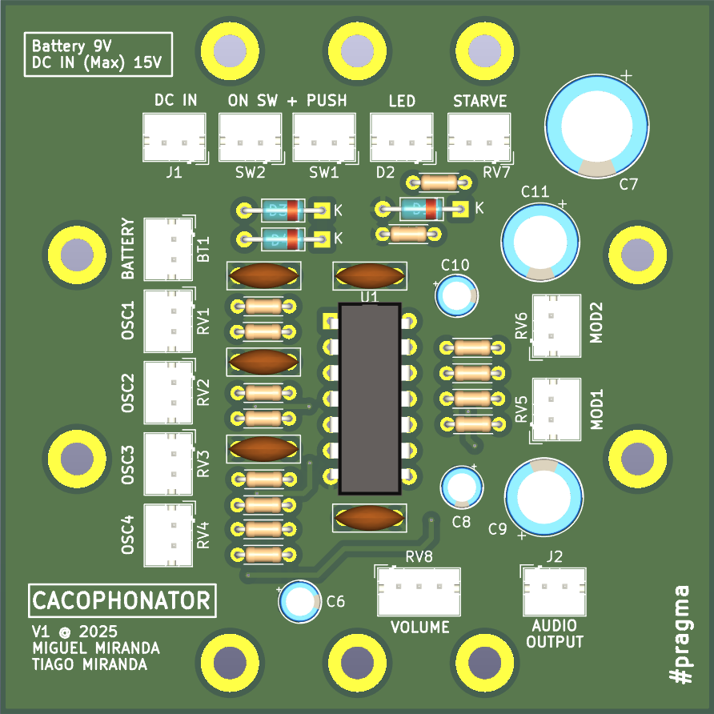
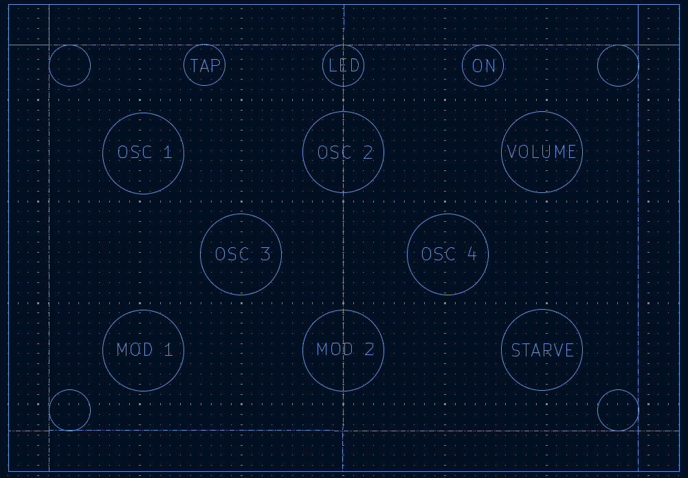
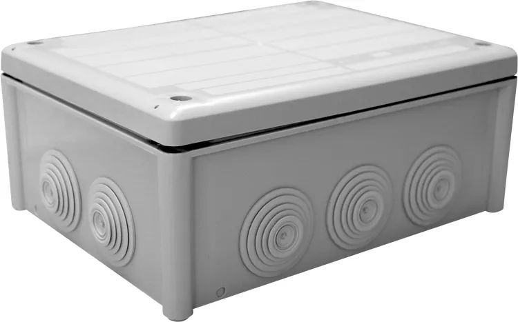

# Cacophonator

This repository contains the [KiCad](https://www.kicad.org/) project of a try at recreating an instance of
**[the cacophonator](https://www.theremin.us/Circuit_Library/cacophonator.html)**
by Arthur Harrison. 

### Build iteration

#### V1 THT

- Using THT (Through-hole) components
- Desgined for [JSL 166x116x70mm Box](https://www.leroymerlin.pt/produtos/caixa-estanque-10-boquilhas-153x102x67mm-ip66-cinzento-jsl-15918315.html)

## Modifications to the original
 
- Added a potentiometer to control the output amplitude (volume)
   - Should be a **logaritmic (log) potentiometer**
- Added DC Input jack with diodes for multiple, concurrent, power sources
   - Battery (9V)
   - DC IN (12V)

## Notes

Designed with Kicad 9.0 

Top cover layout tryout

Box

### BOM - Bill of Materials

[BOM](icad/outputs/v1/cacophonator-bom.ods)

### Links

- https://www.theremin.us/Circuit_Library/cacophonator.html
- https://syntherjack.net/catophonator/
- https://vitrolxul.mitiendanube.com/productos/cacophonator/
- http://analogmodularsystem.blogspot.com/2014/01/cacophonator-i.html
- https://milwaukeemakerspace.org/2011/09/cacophonator/
- https://beavisaudio.com/projects/cmossynthesizers/
- https://blacblob.qsdf.org/2018/10/03/cacophonator/
- https://static.flickr.com/100/312128991_4e7175fa40.jpg?v=0
- https://www.ti.com/lit/an/slyt336/slyt336.pdf?ts=1739280684395
- https://www.flickr.com/photos/53178019@N00/page2
- https://electro-music.com/forum/post-328159.html
- https://dimsos.dk/cacophonator/cacophonator-take-2-v8/
- https://www.matrixsynth.com/search/label/Cacophonator
- http://www.subtlenoisemaker.com/cacophonator_noir.html

